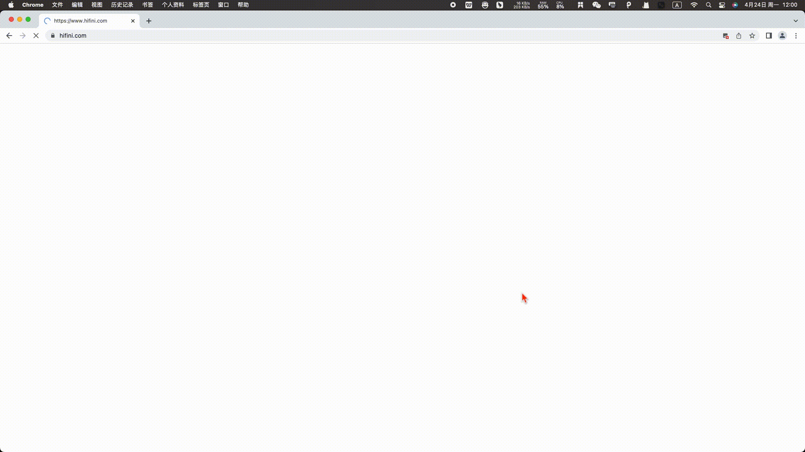
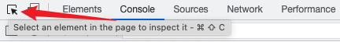
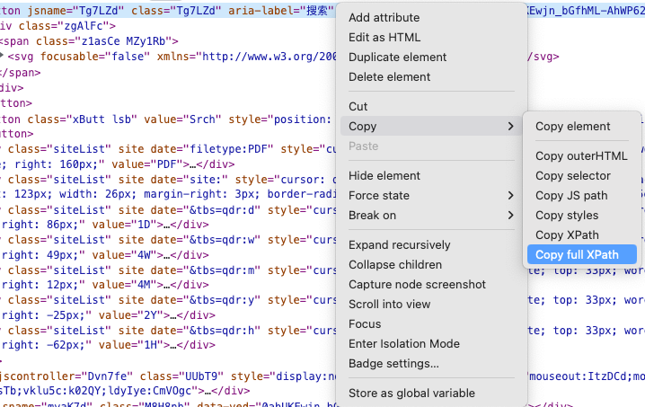
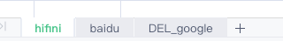

# se_auto_click

se_auto_click 是一个基于 Selenium 的自动化操作工具，可以通过 Excel 配置来模拟用户在浏览器中的各种操作。

## 功能特点

- 支持多种操作类型（包括点击、输入文本、全局上下文等）；
- 支持通过 Excel 配置来实现自动化操作；

## 演示



## 安装方法

1. 从 GitHub 上将源代码克隆到本地：

```shell
$ git clone https://github.com/selierlin/se_auto_click.git
```

2. 进入项目目录，安装必要依赖：

```shell
cd se_auto_click
pip install -r requirements.txt
```

3. 配置文件

将 `config-template.json` 复制为 `config.json` ，具体配置内容，查看下下方

```shell
cp config-template.json config.json
```

将 `配置模板.xls` 复制为 `配置.xls` ，并根据操作要求自行配置

```shell
cp 配置模板.xls 配置.xls
```

4. 启动程序：

```shell
python run.py <XLS FILE>
```

其中 XLS FILE 为你存放 xls 文件的路径，默认为当前目录下 `配置.xls`。

## 使用说明

1. 将需要执行的操作用 Excel 表格列出，每次执行一行；
2. 将 Excel 文件保存到 `data` 目录下，并命名为 `task.xlsx`；
3. 根据需要修改 `config/config.ini` 中的配置项；
4. 运行 `main.py` 文件开始执行任务。

详细的使用说明请参考项目文档。

## config-template.json

```json
{
  "IS_SEND_NOTIFY": false, # 是否发送通知
  "PUSH_PLUS_TOKEN": "YOUR PUSH PLUS KEY", #push plus key，请从官网获取：https://www.pushplus.plus/
  "QYWX_KEY": "YOUR QYWX ROBOT KEY", # 企业微信机器人
  "HTTP_PROXY": "http://127.0.0.1:7890" # 设置代理
}
```


## 配置模板.xls


操作方式目前支持：`input`, `click` , `click_text` , `text` , `sleep` , `url` , `cookie` , `f5` 

* url：需要打开的网址，网址填写在 **参数列** 中。
* cookie：设置cookie， 填写在 **参数列** 中。
* sleep：等待时间，填写在**参数列**中，单位：秒。
* input：输入事件，通过**元素位置列**定位到对应元素，将**参数列**中的内容。
* click：点击事件，通过**元素位置列**定位到对应元素。
* click_text：模糊点击，通过**元素位置列**定位到包含指定文本的元素。
* f5：刷新页面
* text：获取文本内容，通过**元素位置列**获取该元素下的文本内容。

text还支持 设置全局变量，示例：`链接: (?P<url>.+?)提取码: (?P<code>\w+)`，该表达式会将匹配的内容存入到全局字典中，用于上下文使用，使用方法为在参数列使用`${url}`，则执行到该步骤时从全局字典中获取变量；

这是 Python 中的正则表达式语法，用于匹配包含链接和提取码的字符串，并将它们分别提取出来。该正则表达式的具体含义如下：

- `(?P<url>.+?)` 表示匹配任意字符（`.+?`）并将其命名为 `url`。
- `(?P<code>\w+)` 表示匹配任意字母、数字或下划线字符（`\w+`）并将其命名为 `code`。


## 常见问题

1. 编号有啥用？ - 目前没啥用，不过如果编号为 `-1` 时，该步骤不执行。
2. 执行步骤有啥用？ - 用于控制台的日志显示，方便排查问题
3. 元素位置如何获取？ - 使用Chrome/Edge等浏览器，按下 `F12`，使用元素选择工具点击对应位置



右击-Copy-Copy full XPath，填入元素位置即可。


4. 如果有多种需求是否需要配置不同的xls文件？ - 不需要，你可以新增加一个Sheet，注意Sheet名称以 `DEL_` 开头的不会被执行。


## 贡献说明

如果您在使用过程中遇到任何问题，或者有任何建议或意见，请通过 GitHub Issues 或 Pull Requests 来与我们交流。
同时，我们欢迎开发者们贡献代码、提交 Issue 或提供其他支持。

## 版权信息

se_auto_click 采用 MIT License 许可协议，可以自由地使用、修改和传播。